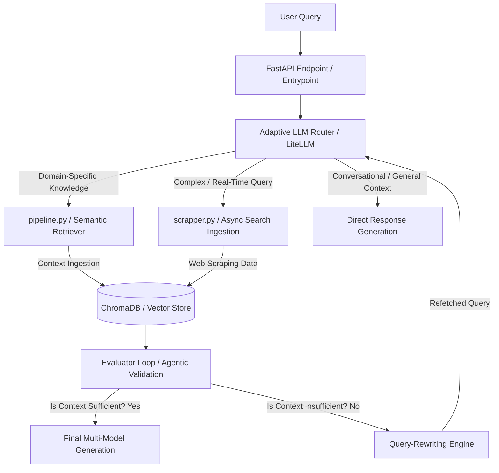

# Enterprise Adaptive RAG (Retrieval-Augmented Generation) Pipeline 🧠

An advanced, production-ready document orchestration and retrieval engine that implements an **Adaptive RAG architecture**. 

Unlike static RAG systems, this pipeline uses an intelligent LLM classifier router to dynamically analyze user queries, determine the optimal retrieval strategy (Vector Store Search, Live Web Scraping, or Direct LLM Generation), and self-correct retrieval gaps using automated query-rewriting loops.

## 🏗️ Systems Architecture & Decision Flow

🛠️ **Tech Stack & Engineering Choices**
Dynamic Routing Layer: Built with LiteLLM and LangChain to evaluate queries and orchestrate multi-agent decision loops. LiteLLM provides seamless failover abstractions across model endpoints (GPT-4, Claude, Gemini, Llama3).

Asynchronous Web Scraper (scrapper.py): Utilizes aiohttp to perform real-time, non-blocking fallback scraping when vector store documents do not satisfy query metrics.

Low-Latency Vector Store: Integrated with ChromaDB for high-speed chunk indexing, utilizing semantic mathematical scoring to rank document retrieval relevance.

Async API Engine: Backed by FastAPI and asynchronous worker loops (Sanic concepts) to guarantee stable data streaming pipelines and fast API gateway speeds.

Enterprise CI/CD Automation: Fully protected by a GitHub Actions CI workflow running automated formatting (Black), security linting, and a robust test suite (pytest) on every deployment.

🚀 **Quick Start (Local Deployment)**
1. Clone & Environment Configuration

    Bash
    git clone [https://github.com/yourusername/Adaptive_rag.git](https://github.com/yourusername/Adaptive_rag.git)
    cd Adaptive_rag
    cp .env.example .env

   Configure your required OPENAI_API_KEY or GEMINI_API_KEY credentials inside the .env file.

2. Containerized Execution via Docker

    Bash
    docker build -t adaptive-rag-service .
    docker run -p 8000:8000 --env-file .env adaptive-rag-service

Once spun up, test the intelligent routing metrics live via the OpenAPI documentation at http://localhost:8000/docs.

📈 **Key Engineering Highlights**
Self-Correction Evaluator Loop: Engineered an automated validation check that grades retrieved document relevance; if relevance falls below a set threshold, a query-rewriter refetches live data, drastically reducing hallucination rates.

High-Throughput Concurrency: Optimized chunking pipelines with concurrent token streaming to ensure parallel document token processing does not impact system latency.

Production Code Architecture: Maintained absolute separation of concerns (Routing vs. Scraping vs. Evaluating) with zero high-severity vulnerabilities and integrated static code quality gates.
